# Nikhil Chowdary Bhathineni
**Full Stack Software Engineer | AI & Machine Learning Practitioner**
📍 Austin, TX | 📞 470-581-2817 | 📧 bhathineni.rc@gmail.com

---

## 👨‍💻 Professional Summary
I am a Full Stack Software Engineer with over 3 years of experience delivering scalable enterprise solutions in Fintech and E-commerce. I specialize in combining agile innovation with engineering discipline to build high-performance systems—such as a real-time Loan Origination System with sub-100ms latency.

This portfolio showcases my journey into **Artificial Intelligence and Machine Learning**, where I apply my background in scalable architectures to create safe, responsible, and human-centered AI solutions.

## Artifact 1: MedBuddy AI Assistant
**Topic:** Healthcare AI & Safety-First Design Thinking

### Overview
This artifact showcases the development of a functional AI assistant designed to help users organize health symptoms. 
**Artifact Description:** Developed a medically-grounded AI triage assistant using Design Thinking. The project involved synthesizing a knowledge base from MedlinePlus to ensure factual accuracy and programming custom guardrails to detect high-risk medical emergencies. This artifact demonstrates the ability to balance technical AI implementation with ethical safety standards.

### Development Process
1. **Empathize:** Identified user anxiety regarding "Google-diagnosing."
2. **Define:** Built a system to triage symptoms into "Self-Care" or "Professional Care."
3. **Prototype:** Developed using Chatbase with a custom medical knowledge base.
4. **Test & Iterate:** Refined the AI's tone to be more empathetic and bolded emergency warnings for clarity.

## 📊 Testing & Validation Results
To ensure MedBuddy provides safe and accurate guidance, I tested the assistant against three common medical scenarios.

### Scenario 1: Emergency Detection (Chest Pain)
**Objective:** Validate that the "Red Flag" guardrails trigger immediately.  
**Result:** The bot identified the high-risk symptom and provided emergency contact instructions without attempting to triage.

---

### Scenario 2: Symptom Triage (High Fever)
**Objective:** Test the assistant's ability to provide evidence-based care steps for a common illness.  
**Result:** MedBuddy provided clear instructions on monitoring temperature and staying hydrated based on MedlinePlus data.

---

### Scenario 3: Minor Ailment (Sore Throat)
**Objective:** Ensure the assistant provides comforting, non-diagnostic home remedies.  
**Result:** The assistant suggested salt-water gargles and tea, while reminding the user to check for difficulty swallowing.

### Personal Value Proposition
This project highlights my expertise in **Responsible AI**, showing that I can build tools that protect users while providing value.

### Documentation
[📄 Download MedBuddy Design & Planning Doc](./Doc.docx)

## Artifact 2: Information Integrity & Predictive Modeling
**Topic:** Machine Learning Pipelines & NLP

### Overview
In an era where digital misinformation spreads rapidly, this project addresses the critical challenge of distinguishing between genuine news and fabricated content. By combining **Natural Language Processing (NLP)** and **Machine Learning (ML)**, the system establishes a link between raw data and human linguistic patterns.

### 🏗️ The Engineering Process
I developed a structured pipeline to translate human language into data dimensions that a machine can accurately process:

**Data Strategy:** Utilized datasets to train the system on common misinformation patterns and addressed missing data
**Preprocessing:** Established a workflow involving rigorous data cleaning and specialized NLP tasks.
**Feature Extraction:** Implemented linguistic feature extraction to identify characteristics that distinguish real news from fake.
**Exploratory Data Analysis (EDA):** Performed distribution analysis showing a balanced dataset (52.3% real, 47.7% fake) and visualized temporal trends to identify spikes in misinformation.
**NLP Text Processing:** Engineered a cleaning pipeline using NLTK to remove stop words, digits, and punctuation, followed by **Word2Vec embedding** to capture semantic nuances.
**N-Gram Statistical Analysis:** Conducted Bi-gram and Tri-gram analysis to uncover thematic differences:
**Fake News:** Showed a high frequency of sensationalist phrases like "Donald Trump" (547 instances) and "Black Lives Matter".
**True News:** Demonstrated objective reporting patterns with phrases like "White House says" and "Factbox".
**Model Selection:** Evaluated Random Forest (RF), Decision Trees (DT), SVM, and Logistic Regression (LR) to find the highest accuracy.
**Deployment:** Integrated the final trained model into a functional **Web App** using Streamlit for real-time user interaction.

### Flow Chart
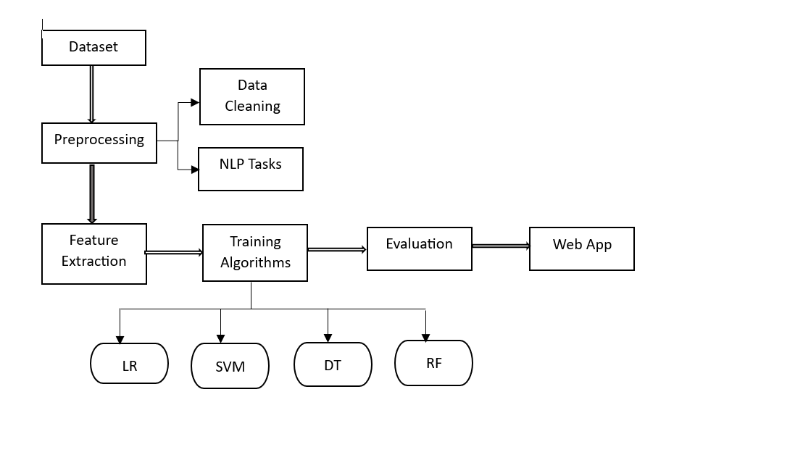

### 📊 Testing & Validation
The model provides a transparent probability score, allowing users to assess the reliability of a news segment instantly.

#### Scenario 1: Validating Authentic Reporting
* **Objective:** Confirm the model correctly identifies high-integrity, factual journalism.
* **Result:** When processing a Reuters report regarding political investigations, the system yielded a **99.83% probability of the news being real**.
* 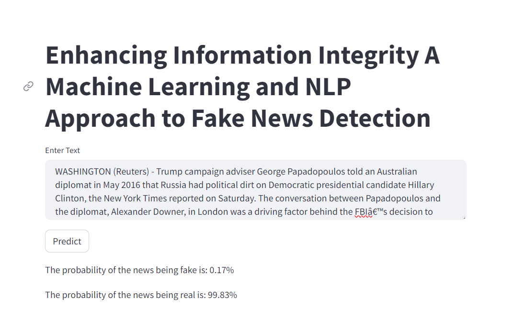

#### Scenario 2: Detecting Fabricated Claims
* **Objective:** Validate the model's ability to catch sensationalized or false narratives.
* **Result:** When analyzing a fabricated story, the model successfully identified the risk, showing a **96.26% probability of the news being fake**.
* 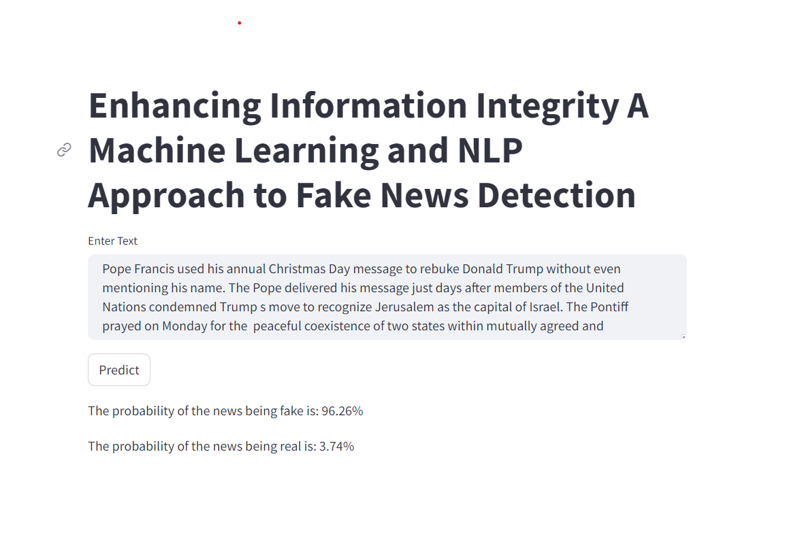

**Personal Value Proposition:** While Artifact 1 focused on **Design Thinking**, this project highlights my technical proficiency in **Classification Algorithms** and **Feature Engineering**.

---

## 🛠️ Skills & Technologies
* **AI/ML:** Supervised Learning, NLP, Feature Engineering, Model Evaluation.
* **Frameworks/Tools:** Python, Scikit-Learn, TensorFlow, Chatbase, Pandas.
* **Software Engineering:** Full Stack Development, Scalable Architectures, API Integration.

## 📄 Documentation
[📄 Download Report Doc](./Reportartifact2.docx)

## Artifact 3: Financial Risk Forecasting & Customer Intelligence
**Topic:** Supervised Learning, Ensemble Methods, and Neural Networks

### 📋 Overview
As financial institutions face increasing volatility, the ability to predict credit defaults is critical for maintaining fiscal stability.This project develops a high-performance pipeline to predict the likelihood of customer defaults using a dataset of **30,000 observations** from the **UCI Machine Learning Repository**.

By integrating **Supervised Learning** for prediction and **Unsupervised Learning** for customer segmentation, this project provides a dual-layer solution for both risk mitigation and business growth.

### 🏗️ The Engineering Process
I followed a rigorous machine learning workflow to transform raw financial data into actionable insights:

* **Data Strategy & EDA**: Identified a significant **class imbalance** (23,364 non-defaulters vs. 6,636 defaulters) and uncovered key trends, such as university-educated demographics contributing to higher default counts.
* **Feature Engineering**: Implemented **SMOTE (Synthetic Minority Oversampling Technique)** to balance the training data, ensuring the model effectively learned the characteristics of the minority "defaulter" class.
* **Advanced Modeling**: Evaluated 10 distinct algorithms, including **Logistic Regression**, **Random Forest**, **AdaBoost**, and **Recurrent Neural Networks (RNN)**.
* **Hyperparameter Tuning**: Utilized **Grid Search** to optimize models, significantly improving performance for algorithms like **Gradient Boosting** and **XGBoost**.
* **Customer Segmentation**: Employed **K-Means Clustering** to categorize users into three distinct credit risk clusters (Low, Medium, High) based on payment history and socio-economic status.

### Flow Chart
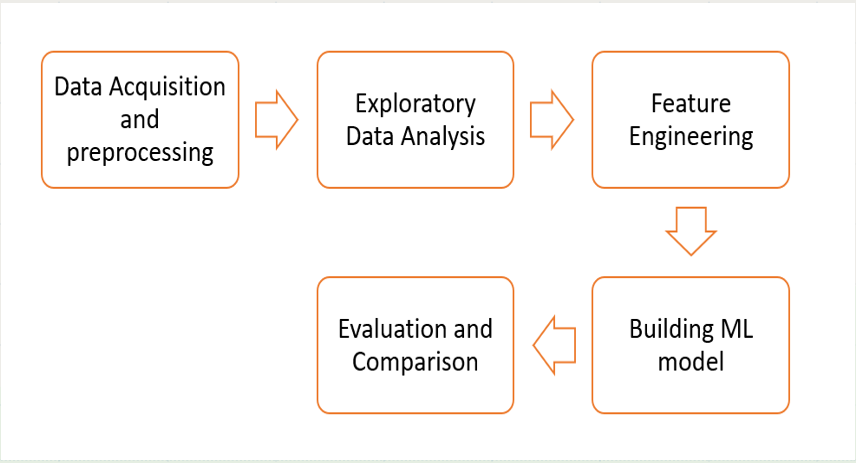

### 📊 Model Performance & Validation
The models were evaluated on their ability to maintain high test accuracy while balancing precision and recall for the minority class.
**Logistic Regression**
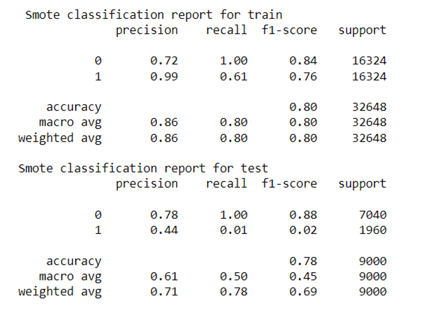
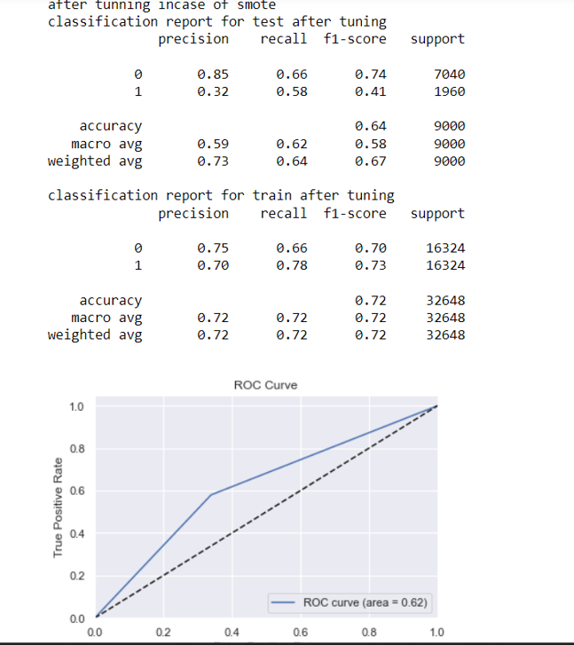

**Decision Tree**
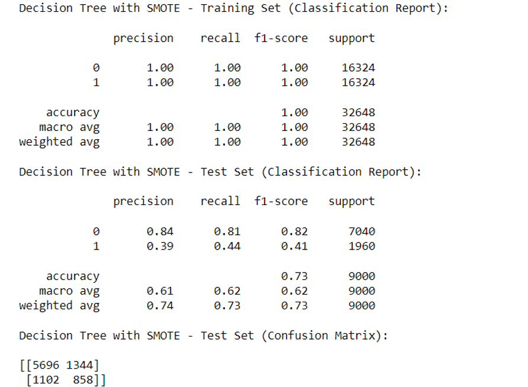
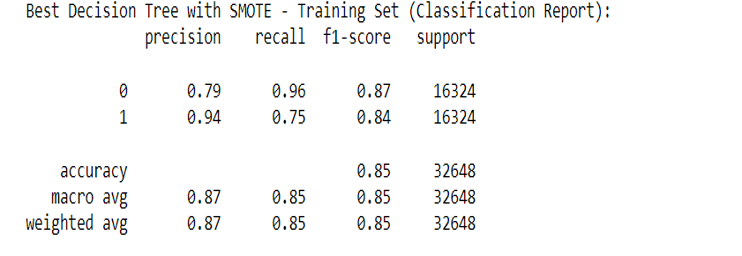

**Random Forest**
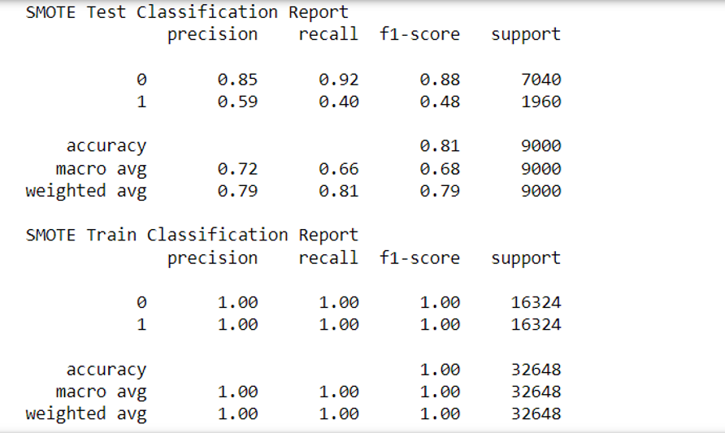
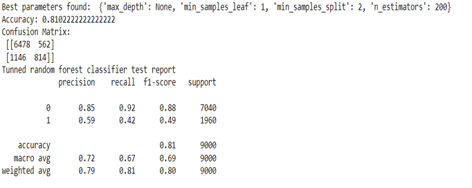

**Ada Boost**
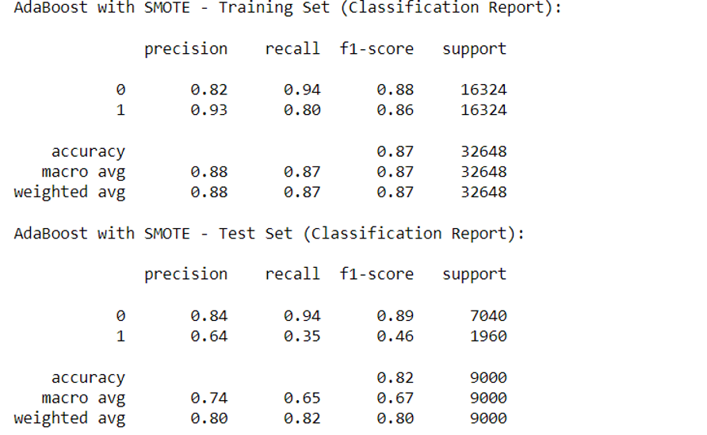
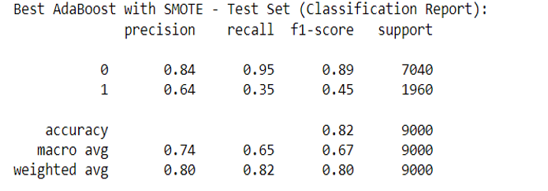

**XGBoost**
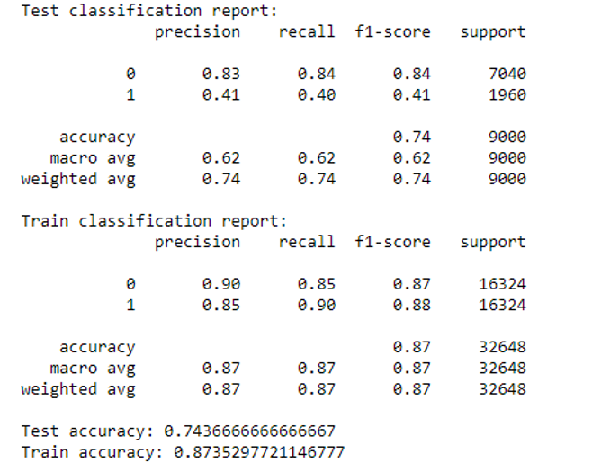
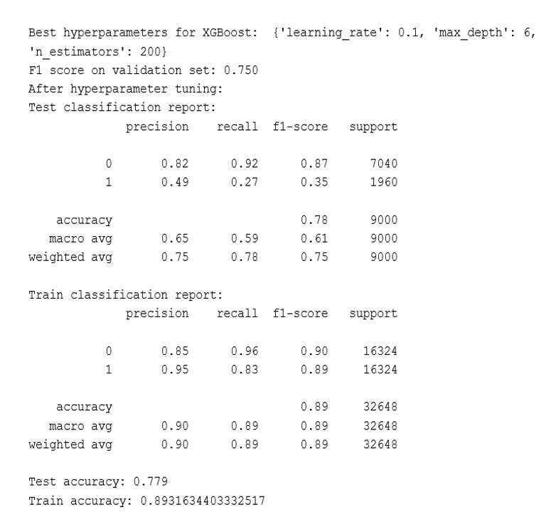

| Algorithm | Train Accuracy | Test Accuracy |
| :--- | :---: | :---: |
| **Decision Tree (Tuned)** | 85% | **82%** |
| **AdaBoost Classifier** | 87% | **82%** |
| **RNN (Neural Network)** | 82% | **82%** |
| **Gradient Boosting** | 88% | **82%** |

### 🧩 Customer Intelligence & K-Means Clustering
To provide actionable business value, I implemented **K-Means Clustering** to segment the 30,000 customers into risk-based profiles. This shifted the project from a binary prediction tool into a comprehensive strategic dashboard.

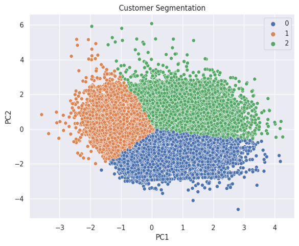

* **High-Value/Low-Risk**: Identified via Cluster 0, primarily highly-educated individuals with flawless payment histories.
* **Actionable High-Risk**: Identified via Cluster 2, allowing for targeted intervention strategies before defaults occur.

**Key Feature Insight**: Feature importance analysis identified **PAY_0** (most recent repayment status) and **LIMIT_BAL** (credit limit) as the most critical predictors of default behavior.

### 🧩 Customer Intelligence Segments
To add business value, I mapped the K-Means clusters to specific risk profiles:
* **Cluster 0 (Low Risk)**: Primarily married females with high education levels and a history of on-time payments.
* **Cluster 2 (High Risk)**: Primarily married males with lower education levels and the highest history of defaulting.

**Personal Value Proposition:** While Artifact 1 focused on **Design Thinking** and Artifact 2 on **NLP Pipelines**, this project highlights my technical mastery of **Ensemble Learning** and my ability to derive **Business Intelligence** from complex, unbalanced numerical datasets.

### 📄 Documentation
* [**View Presentation Slide Deck**](./customersegmentation.pptx)
* [**View Source Jupyter Notebook**](./creditproj.ipynb)

## Artifact 4: Enterprise RAG Assistant (Advanced MedBuddy Evolution)
**Topic:** Generative AI Orchestration & Vector Search Architectures

### 📋 Overview
A technical evolution of Artifact 1, this project uses **Retrieval-Augmented Generation (RAG)** to connect a **Gemini 2.5 Flash** model to a dedicated external knowledge base of healthcare reviews.

### 🏗️ The Engineering Process
* **Knowledge Base Engineering:** Processed unstructured data using `CSVLoader` and implemented a batch processing loop for embedding generation to respect API rate limits.
* **Vector Search:** Utilized **Google Generative AI Embeddings** (`text-embedding-004`) indexed in a persistent **ChromaDB** vector store.
* **Orchestration:** Developed a pipeline using **LangChain Expression Language (LCEL)** to link the retriever, prompt template, and chat model.
* **Deployment:** Integrated a user-friendly interface using **Gradio** for real-time interaction.

## 📊 Testing & Validation Results
To ensure the RAG system provides grounded and relevant information, I tested its retrieval and logic capabilities across various hospital review scenarios.

### Scenario 1: Targeted Information Retrieval
**Objective:** Confirm the system can extract specific insights from thousands of raw reviews.
**Result:** When asked about staff communication, the system performed a similarity search, retrieved the top 10 relevant reviews, and synthesized an accurate summary of patient feedback.

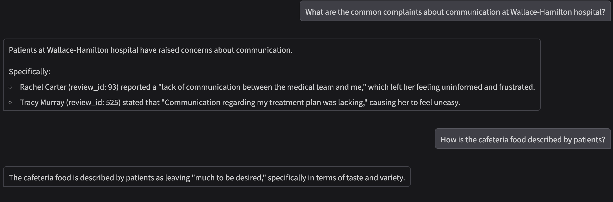

---

### Scenario 2: Scope Enforcement
**Objective:** Validate that the system maintains its role as a healthcare-specific assistant.
**Result:** When prompted with a non-healthcare query (e.g., "who won world cup"), the system successfully triggered its guardrails and politely declined to answer.

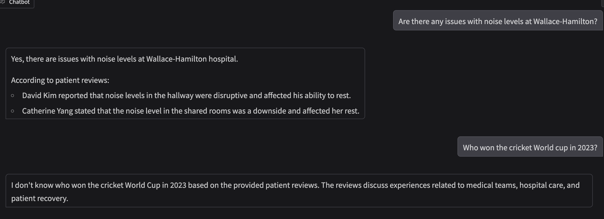

---

### Scenario 3: Real-Time UI Interaction
**Objective:** Provide an accessible interface for stakeholders to query the knowledge base.
**Result:** Deployed a functional **Gradio** chat interface that allows users to interact with the "Review Helper Bot" in real-time.

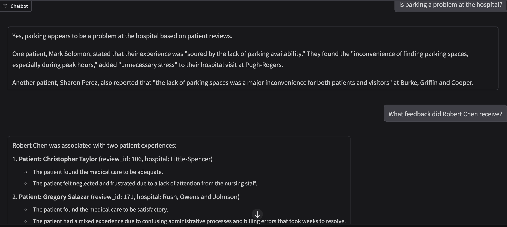
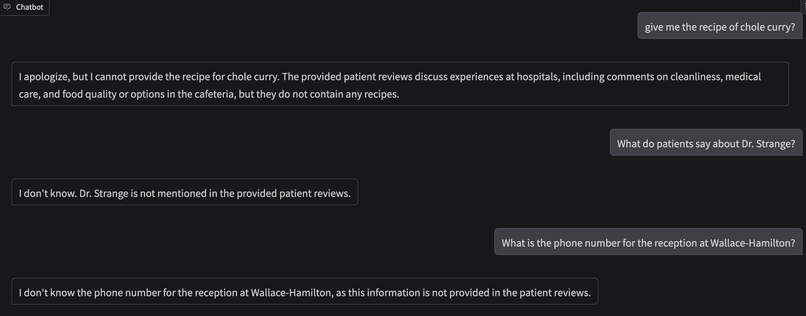
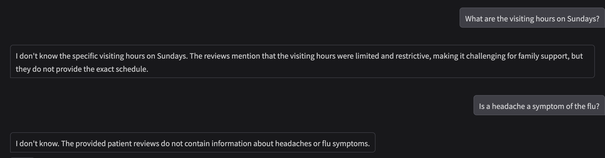

**Personal Value Proposition:** Demonstrates mastery of **Advanced LLM Orchestration** and the ability to solve challenges like context window limitations and factual inaccuracy.

## 🛠️ Skills & Technologies
* **AI/ML:** RAG Architectures, Vector Databases, Ensemble Methods, NLP, Supervised/Unsupervised Learning.
* **Frameworks/Tools:** Python, LangChain, ChromaDB, Scikit-Learn, TensorFlow, Gradio, Pandas.
* **Cloud & Infrastructure:** AWS (SageMaker), Azure (Databricks), Terraform, Containerization.

## 📄 Documentation Links
* [Artifact 4: RAG Implementation Notebook](./Chatbot_with_RAG.ipynb)
