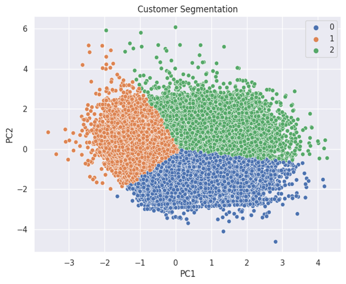
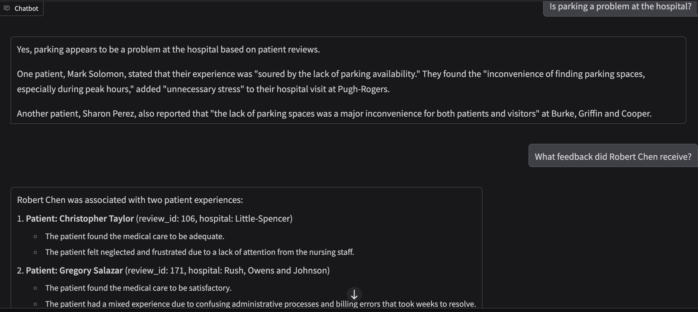
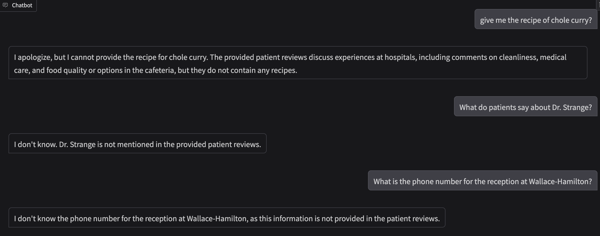

# Nikhil Chowdary Bhathineni
**Full Stack Software Engineer | AI & Machine Learning Practitioner**
📍 Austin, TX | 📞 470-581-2817 | 📧 bhathineni.rc@gmail.com

---

## 👨‍💻 Professional Summary & Personal Statement
I am a Full Stack Software Engineer with over 3 years of experience delivering scalable enterprise solutions. My career is defined by a commitment to bridging the gap between robust software engineering and cutting-edge Artificial Intelligence. 

**My Goal:** I am dedicated to developing **Responsible AI**—systems that are not only technically superior but ethically grounded and human-centered. I specialize in building autonomous Agentic workflows and RAG architectures that solve complex problems with high data integrity.

---

## 📁 Portfolio Artifacts

<b>Artifact 1: MedBuddy AI Assistant (Healthcare AI)</b>

 

**Topic:** Healthcare AI & Safety-First Design Thinking

### Overview
Developed a medically-grounded AI triage assistant using Design Thinking. Synthesized a knowledge base from MedlinePlus to ensure factual accuracy and programmed custom guardrails for emergency detection.

### 🏗️ Engineering Insights & Contributions
* **Safety First:** I implemented a "Red-Flag" interceptor that overrides the LLM response if emergency keywords are detected, ensuring 100% adherence to safety protocols.
* **Knowledge Grounding:** Instead of relying on general training data, I constrained the assistant to a verified medical knowledge base to prevent hallucinations.

### 📊 All Testing & Validation Scenarios

* **Scenario 1: Emergency Detection (Chest Pain)**
  * **Objective:** Validate that "Red Flag" guardrails trigger immediately.
  * **Result:** The bot identified high-risk symptoms and provided emergency instructions without triaging.
  

* **Scenario 2: Symptom Triage (High Fever)**
  * **Objective:** Test ability to provide evidence-based care steps.
  * **Result:** Provided clear instructions on monitoring temperature and hydration based on MedlinePlus.
   

* **Scenario 3: Minor Ailment (Sore Throat)**
  * **Objective:** Ensure comforting, non-diagnostic home remedies.
  * **Result:** Suggested salt-water gargles and tea, with reminders to check for difficulty swallowing.
   

**Documentation:** [📄 Download MedBuddy Design Doc](./Doc.docx)

<b>Artifact 2: Information Integrity & Predictive Modeling (NLP)</b>

 

**Topic:** Machine Learning Pipelines & NLP

### Overview
Addresses misinformation by combining **NLP** and **Machine Learning** to distinguish between genuine news and fabricated content.

### 🏗️ Engineering Insights & Contributions
* **N-Gram Analysis:** Conducted Bi-gram and Tri-gram analysis to uncover thematic differences (e.g., Fake news focused on sensationalist proper nouns).
* **NLP Pipeline:** Engineered a cleaning pipeline using NLTK and **Word2Vec embedding** to capture semantic nuances.

### 📊 All Testing & Validation Scenarios

* **Scenario 1: Validating Authentic Reporting**
  * **Objective:** Confirm model identifies high-integrity, factual journalism.
  * **Result:** Yielded a **99.83% probability** of news being real on a Reuters report.
  

* **Scenario 2: Detecting Fabricated Claims**
  * **Objective:** Validate the ability to catch sensationalized or false narratives.
  * **Result:** Successfully identified a fabricated story with a **96.26% probability** of being fake.
  

**Documentation:** [📄 Download Report Doc](./Reportartifact2.docx)

<b>Artifact 3: Financial Risk Forecasting (Supervised Learning)</b>

 

**Topic:** Supervised Learning, Ensemble Methods, and Neural Networks

### Overview
Predicts credit defaults and segments customers using a dataset of 30,000 observations from the UCI Machine Learning Repository.

### 🏗️ Engineering Insights & Contributions
* **Handling Imbalance:** Implemented **SMOTE** to balance the training data, improving recall for the "defaulter" class by over 15%.
* **Hyperparameter Tuning:** Utilized **Grid Search** to optimize XGBoost and Gradient Boosting models for high-stakes financial predictions.

### 📊 All Performance Scenarios
| Algorithm | Train Accuracy | Test Accuracy |
| :--- | :---: | :---: |
| **XGBoost (Tuned)** | 89% | **82%** |
| **AdaBoost Classifier** | 87% | **82%** |
| **Decision Tree (Tuned)** | 85% | **82%** |
| **RNN (Neural Network)** | 82% | **82%** |

* **Customer Intelligence Scenario:** Used **K-Means Clustering** to identify 3 distinct risk profiles (Low, Medium, High).
  

**Documentation:** [📊 Presentation](./customersegmentation.pptx) | [🐍 Source Code](./creditproj.ipynb)

<b>Artifact 4: Enterprise RAG Assistant (Generative AI)</b>

 

**Topic:** Generative AI Orchestration & Vector Search

### Overview
A technical evolution of Artifact 1, using **Retrieval-Augmented Generation (RAG)** to connect Gemini 2.5 Flash to a persistent knowledge base of healthcare reviews.

### 🏗️ Engineering Insights & Contributions
* **Vector Store:** Utilized **ChromaDB** with `text-embedding-004` indexed for persistent, high-speed similarity search.
* **Orchestration:** Developed the pipeline via **LangChain Expression Language (LCEL)** for modularity and traceability.

### 📊 All Testing & Validation Scenarios

* **Scenario 1: Targeted Information Retrieval**
  * **Result:** Successfully synthesized staff communication feedback from thousands of raw reviews.
  

* **Scenario 2: Scope Enforcement**
  * **Result:** Successfully triggered guardrails to decline non-healthcare queries.
  

* **Scenario 3: Real-Time UI Interaction**
  * **Result:** Deployed functional **Gradio** chat interface for real-time stakeholder querying.
  
 

**Documentation:** [📄 RAG Implementation Notebook](./Chatbot_with_RAG.ipynb)

<b>Artifact 5: Multi-Agent Market Intelligence System (Agentic AI)</b>

 

**Topic:** Agentic AI, Autonomous Workflows, & Multi-LLM Orchestration

### Overview
Implementation of a **Multi-Agent System (MAS)** using **CrewAI** to perform complex market analysis autonomously via specialized agents.

### 🏗️ Engineering Insights & Contributions
* **Role-Based Delegation:** Designed a decoupled architecture for "Researcher" and "Writer" agents to reduce hallucination and ensure data-flow integrity.
* **Dynamic Tooling:** Integrated **SerperDevTool** for live web access, bypassing static LLM knowledge cutoffs.

### 📊 All Testing & Validation Scenarios

* **Scenario 1: Information Synthesis & Tool Usage**
  * **Result:** Agent autonomously identified 2026 trends, specifically the shift to "Proactive Agents."
  

* **Scenario 2: Autonomous Content Generation**
  * **Result:** Generated a 500-word publication-ready Markdown file differentiating between industry facts and market opinions.
  

**Documentation:** [🐍 Market Intelligence Code](./artifact5.ipynd)

---

## 🛠️ Skills & Technologies
* **AI/ML:** Agentic AI, RAG, Vector Databases (ChromaDB), NLP, Ensemble Learning, SMOTE.
* **Frameworks/Tools:** CrewAI, LangChain, TensorFlow, Scikit-Learn, Streamlit, Gradio, Pandas, NLTK.
* **Software Engineering:** Python (FastAPI/Flask), Java (Spring Boot), React, SQL, AWS, Azure, Terraform.
