# Nikhil Chowdary Bhathineni
**Full Stack Software Engineer | AI & Machine Learning Practitioner**
📍 Austin, TX | 📞 470-581-2817 | 📧 bhathineni.rc@gmail.com

---

## 👨‍💻 Professional Summary
I am a Full Stack Software Engineer with over 3 years of experience delivering scalable enterprise solutions in Fintech and E-commerce. I specialize in combining agile innovation with engineering discipline to build high-performance systems—such as a real-time Loan Origination System with sub-100ms latency.

This portfolio showcases my journey into **Artificial Intelligence and Machine Learning**, where I apply my background in scalable architectures to create safe, responsible, and human-centered AI solutions.

---

## 📁 Portfolio Artifacts

<b>Artifact 1: MedBuddy AI Assistant (Healthcare AI)</b>

 

**Topic:** Healthcare AI & Safety-First Design Thinking

### Overview
Developed a medically-grounded AI triage assistant using Design Thinking. Synthesized a knowledge base from MedlinePlus to ensure factual accuracy and programmed custom guardrails for emergency detection.

### 🏗️ Development Process
1. **Empathize:** Identified user anxiety regarding "Google-diagnosing."
2. **Define:** Built a system to triage symptoms into "Self-Care" or "Professional Care."
3. **Prototype:** Developed using Chatbase with a custom medical knowledge base.
4. **Test & Iterate:** Refined the AI's tone to be more empathetic.

### 📊 Testing & Validation

### Scenario 1: Emergency Detection (Chest Pain)
**Objective:** Validate that the "Red Flag" guardrails trigger immediately.  
**Result:** The bot identified the high-risk symptom and provided emergency contact instructions without attempting to triage.

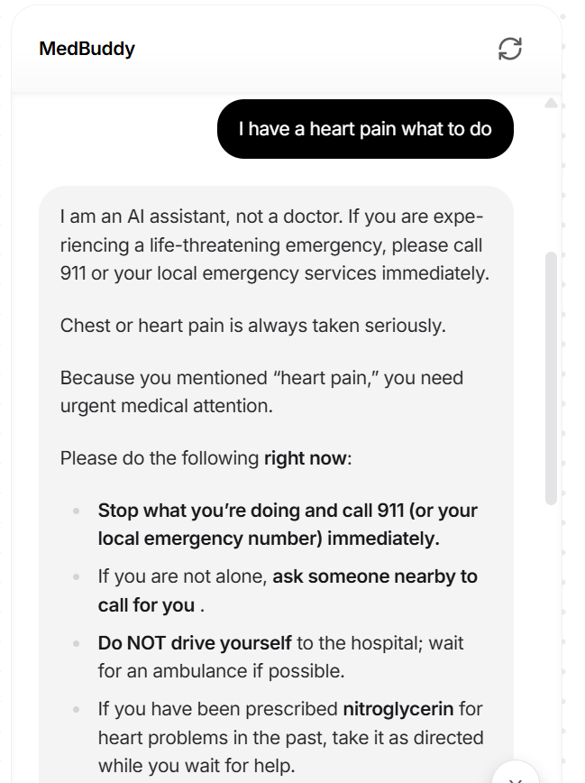

### Scenario 2: Symptom Triage (High Fever)
**Objective:** Test the assistant's ability to provide evidence-based care steps for a common illness.  
**Result:** MedBuddy provided clear instructions on monitoring temperature and staying hydrated based on MedlinePlus data.

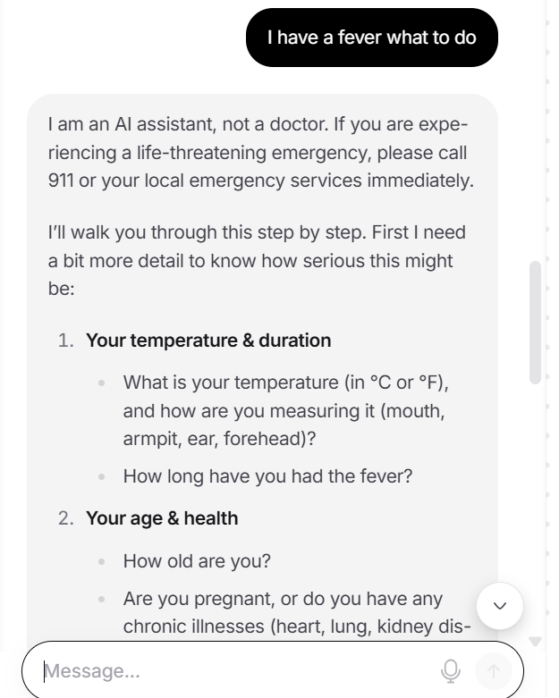
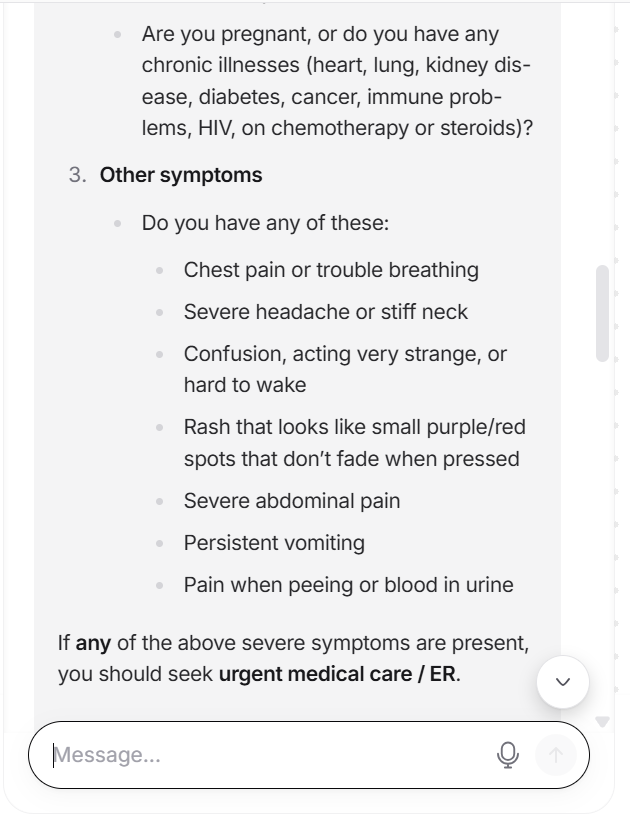

### Scenario 3: Minor Ailment (Sore Throat)
**Objective:** Ensure the assistant provides comforting, non-diagnostic home remedies.  
**Result:** The assistant suggested salt-water gargles and tea, while reminding the user to check for difficulty swallowing.

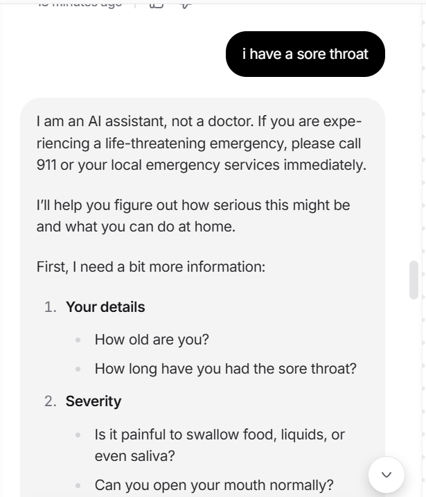
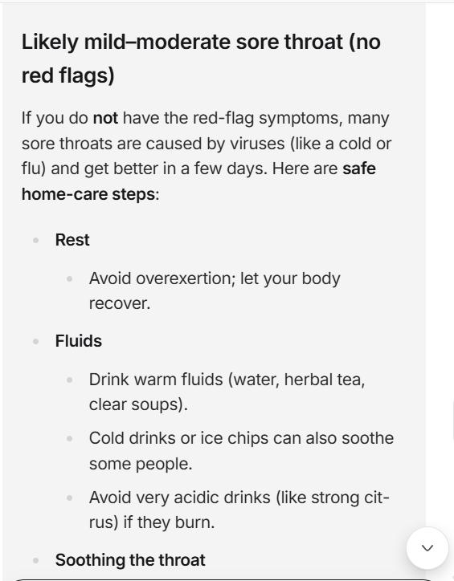

**Documentation:** [📄 Download MedBuddy Design Doc](./Doc.docx)

<b>Artifact 2: Information Integrity & Predictive Modeling (NLP)</b>

 

**Topic:** Machine Learning Pipelines & NLP

### Overview
Addresses misinformation by combining **NLP** and **Machine Learning** to distinguish between genuine news and fabricated content.

### 🏗️ The Engineering Process
* **NLP Processing:** Cleaning pipeline using NLTK and **Word2Vec embedding**.
* **N-Gram Analysis:** Uncovered thematic differences (Objective reporting vs. Sensationalism).
* **Deployment:** Integrated into a functional **Streamlit Web App**.

### 📊 Testing & Validation
* **Authentic Reporting:** 99.83% probability for real news.
  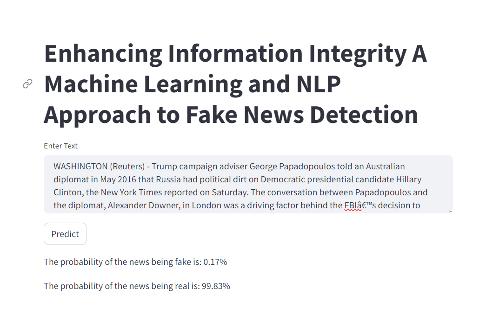
* **Fabricated Claims:** 96.26% probability detection for fake news.
  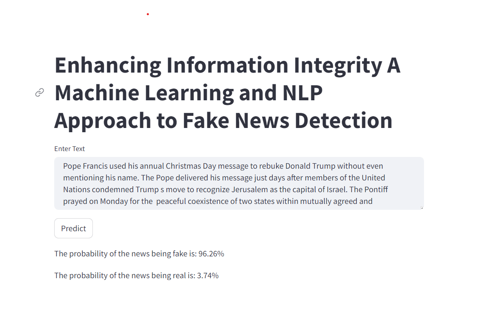

**Documentation:** [📄 Download Report Doc](./Reportartifact2.docx)

<b>Artifact 3: Financial Risk Forecasting (Supervised Learning)</b>

 

**Topic:** Supervised Learning, Ensemble Methods, and Neural Networks

### Overview
High-performance pipeline to predict credit defaults using a dataset of **30,000 observations**.

### 🏗️ The Engineering Process
* **Feature Engineering:** Implemented **SMOTE** to handle class imbalance.
* **Advanced Modeling:** Evaluated algorithms including XGBoost, Random Forest, and RNNs.
* **Intelligence:** Used **K-Means Clustering** to segment users into risk profiles.

| Algorithm | Train Acc | Test Acc |
| :--- | :---: | :---: |
| **XGBoost (Tuned)** | 89% | **82%** |
| **AdaBoost** | 87% | **82%** |
| **RNN** | 82% | **82%** |

**Documentation:** [📊 View Presentation](./customersegmentation.pptx) | [🐍 Source Code](./creditproj.ipynb)

<b>Artifact 4: Enterprise RAG Assistant (Generative AI)</b>

 

**Topic:** Generative AI Orchestration & Vector Search Architectures

### Overview
A technical evolution using **Retrieval-Augmented Generation (RAG)** to connect **Gemini 2.5 Flash** to an external healthcare knowledge base.

### 🏗️ The Engineering Process
* **Vector Search:** Used **ChromaDB** with `text-embedding-004`.
* **Orchestration:** Developed via **LangChain Expression Language (LCEL)**.
* **Deployment:** Real-time UI using **Gradio**.

### 📊 Testing & Validation
* **Targeted Retrieval:** Synthesized communication feedback from thousands of reviews.
  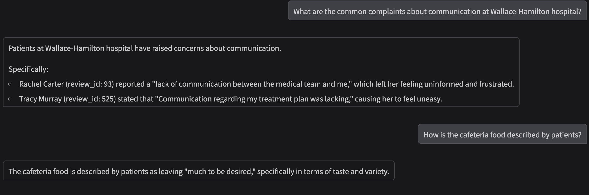
* **Scope Enforcement:** Successfully blocked non-healthcare queries via guardrails.
  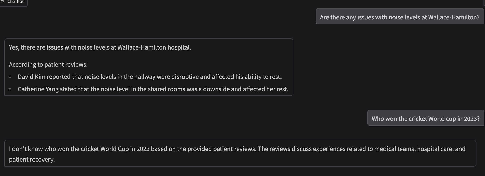

**Documentation:** [📄 RAG Implementation Notebook](./Chatbot_with_RAG.ipynb)

<b>Artifact 5: Multi-Agent Market Intelligence System (Agentic AI)</b>

 

**Topic:** Agentic AI, Autonomous Workflows, & Multi-LLM Orchestration

### Overview
Implementation of a **Multi-Agent System (MAS)** using **CrewAI** to perform complex, multi-step market analysis autonomously.

### 🏗️ The Engineering Process
* **Agent Orchestration:** Configured Researcher and Writer agents with distinct autonomous roles.
* **Dynamic Tooling:** Integrated **SerperDevTool** for real-time web access.
* **Multi-LLM Strategy:** Combined **Gemini 2.5 Flash** (Reasoning) with **GPT-4o-mini** (QA).

### 📊 Testing & Validation
* **Scenario 1: Synthesis** - Identified 2026 AI trends regarding "Proactive Agents."
  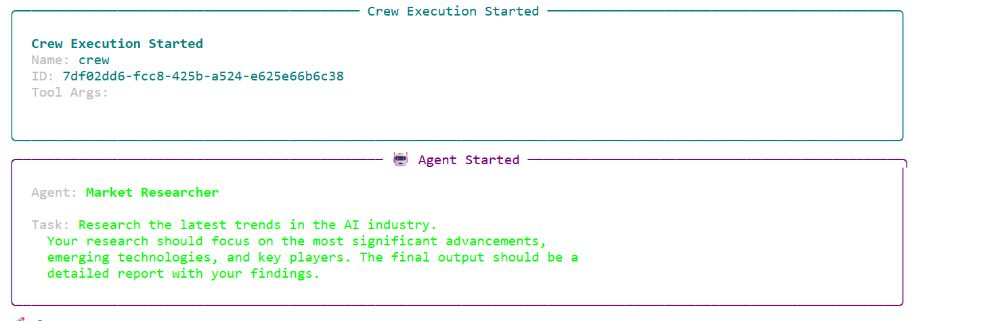
 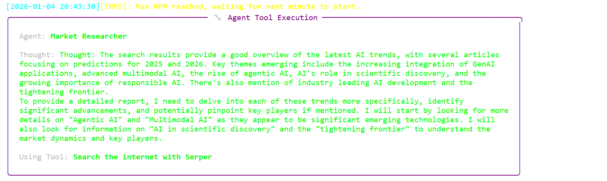
* **Scenario 2: Generation** - Generated a publication-ready Markdown blog post.
  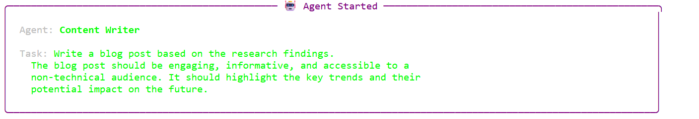
  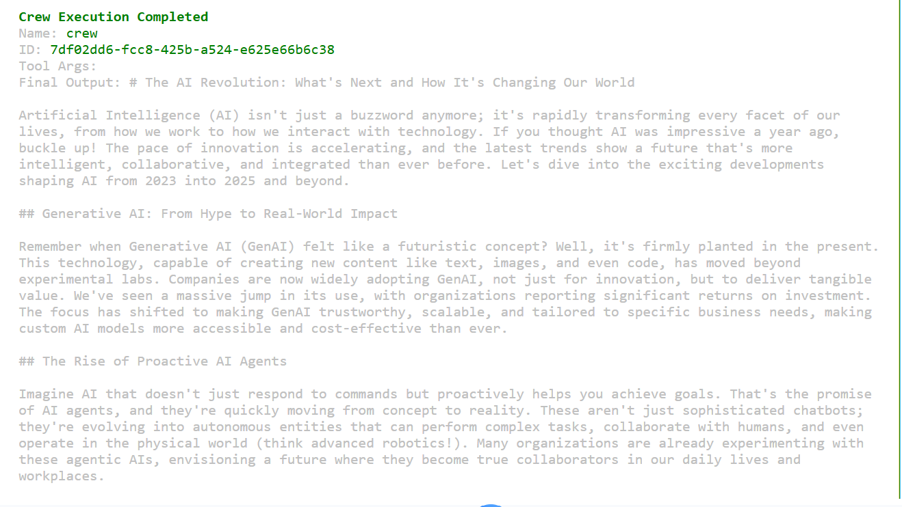

**Documentation:** [🐍 Market Intelligence Implementation](./artifact5.ipynd)

---

## 🛠️ Skills & Technologies
* **AI/ML:** Agentic AI, RAG Architectures, Vector Databases (ChromaDB), NLP, Ensemble Learning, SMOTE.
* **Frameworks/Tools:** CrewAI, LangChain, TensorFlow, Scikit-Learn, Streamlit, Gradio, Pandas, NLTK.
* **Software Engineering:** Python (FastAPI/Flask), Java (Spring Boot), React, SQL, AWS, Azure, Terraform.
